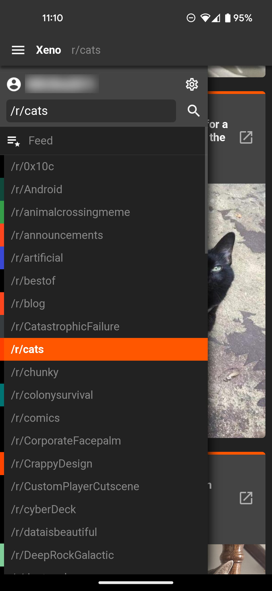
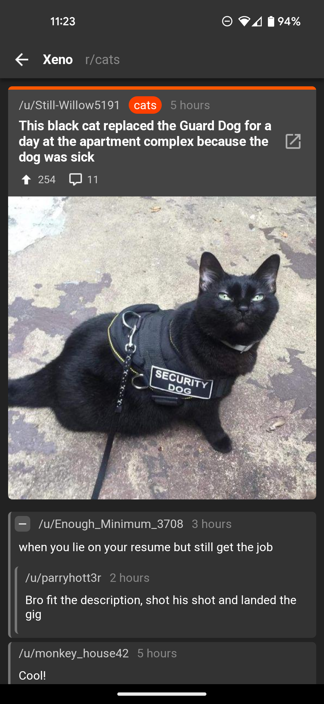
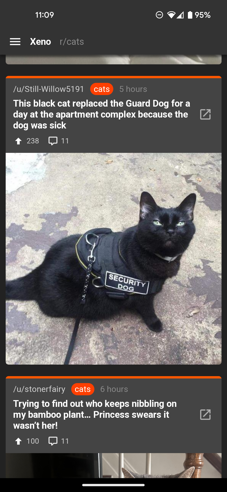
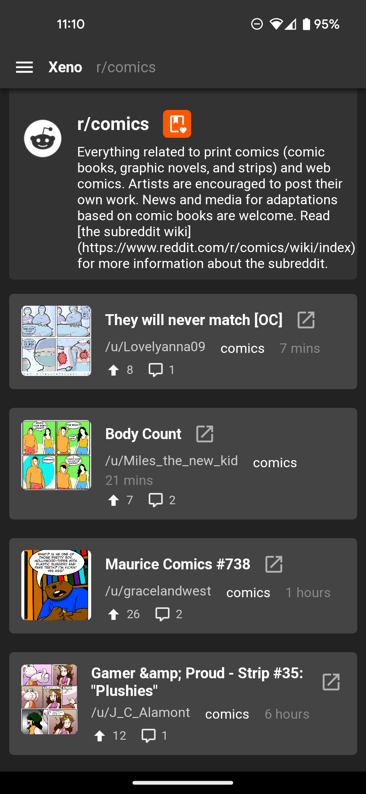
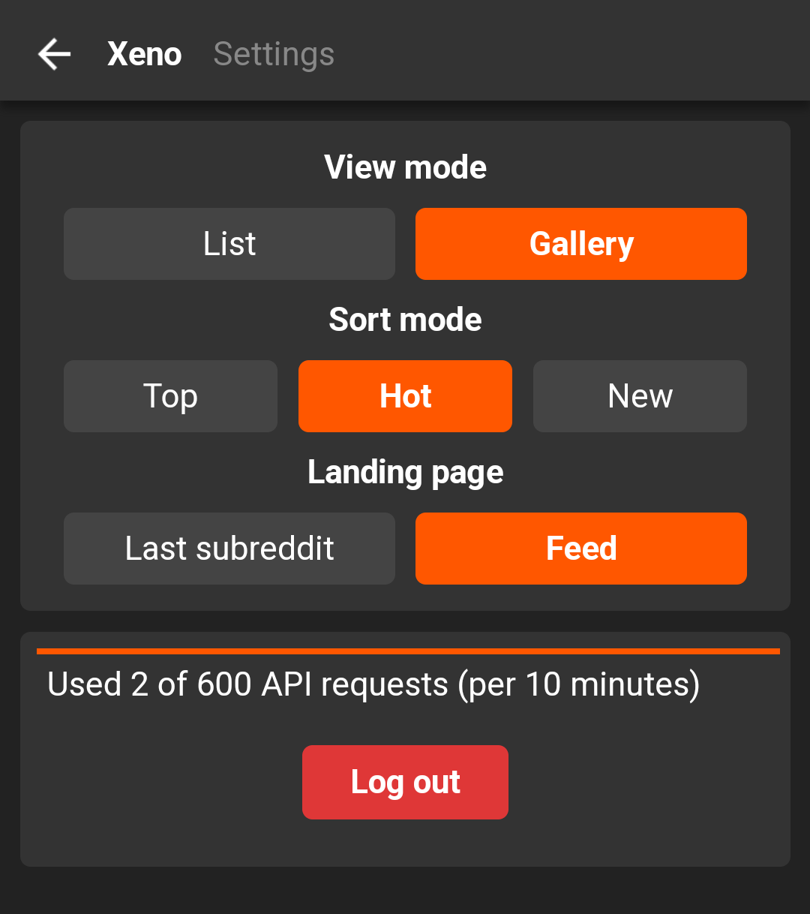
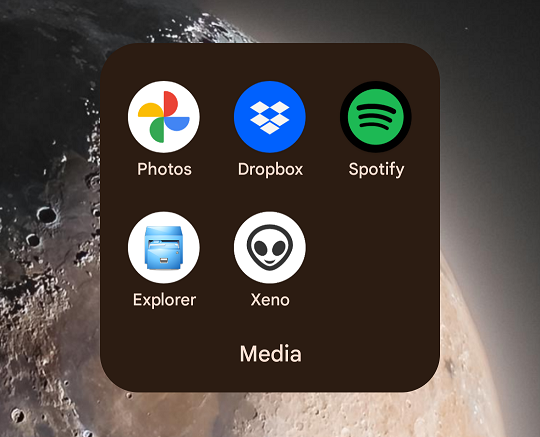

# xeno

Lightweight Reddit browser.



## Features

* Reddit OAuth login.
* Search bar for any subreddit or username.
* Drawer with list of user's subscribed subreddits.
* Feed built from recent popular posts in subscribed subreddits.
* Settings page with options and rate limit usage summary.
* Can be installed as a PWA to homescreen.
* Either list or gallery display modes.
* Multiple sort modes.
* Notation when a post is new since last reload.
* Collapsible comment tree.
* Navigation by post author or subreddit name.
* Simple inline image and video where extractable.
* Subscribe/unsubscribe from subreddits.

## Setup

Install dependencies:

```
npm ci
```

Setup `env.js` file using credentials from
[Reddit apps prefs](https://old.reddit.com/prefs/apps/):

```js
window.CLIENT_ID = '';
window.CLIENT_SECRET = '';
window.REDIRECT_URI = '';
```

## Run

Build and run:

```
npm start
```

## Screenshots

<table>
  <tbody>
    <tr>
      <td></td>
      <td></td>
    </tr>
    <tr>
      <td>Drawer of subreddits</td>
      <td>Post comments</td>
    </tr>
    <tr>
      <td></td>
      <td></td>
    </tr>
    <tr>
      <td>Gallery view</td>
      <td>List view</td>
    </tr>
    <tr>
      <td></td>
      <td></td>
    </tr>
    <tr>
      <td>Settings page</td>
      <td>Install as PWA</td>
    </tr>
  </tbody>
</table>
